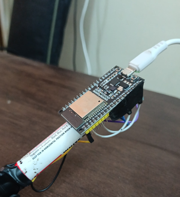

# digital-Air-marker
 **Overview**
The Digital Air Marker is a smart prototype that recognizes digits (0–9) drawn in the air using hand gestures. It uses an MPU6050 IMU sensor and an ESP32 microcontroller to capture motion, which is then interpreted by a deep learning model to identify the digit written — enabling new forms of non-touch human-computer interaction.

**Key** **Features**

 Motion Tracking using MPU6050 (6-axis IMU)

 Digit Recognition powered by LSTM-based machine learning

 Push-button gesture initiation

 Real-time data capture and model prediction via Python

 No touchscreen or keyboard needed

 
 

📄Report
[View Tinkering Lab Report](Tinkering%20Lab%20Report%20(1).pdf)

